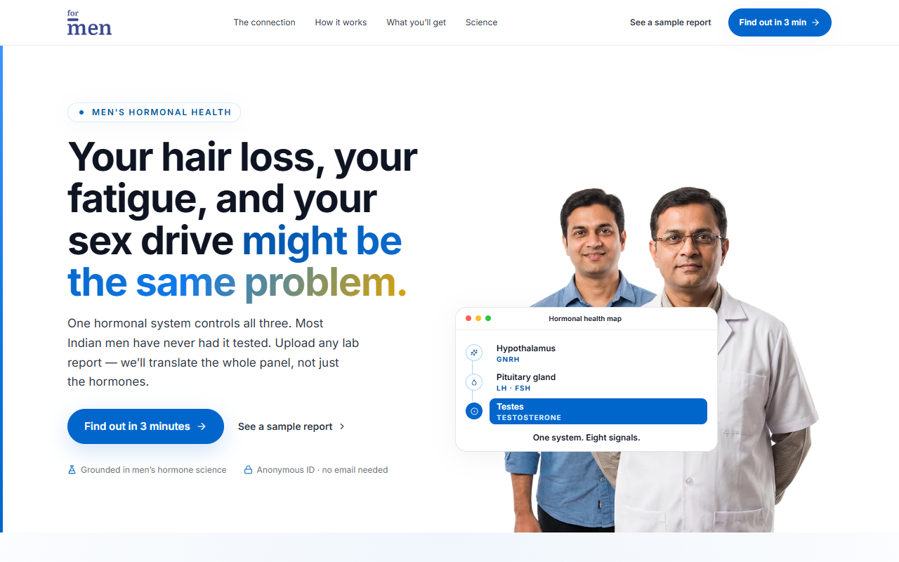

<div align="center">

# Digital Clinic

**A patient-facing health dashboard that turns lab reports into plain English — entirely in the browser.**

Upload a PDF or photo of your blood work. The app parses it client-side (no server, no upload), scores you across hormonal / metabolic / cardiac / thyroid / vitamin axes, and shows trends over time. Pairs with a symptom quiz that recommends the right tests when you don't have a report yet.

<p>
  <a href="https://react.dev/"></a>
  <a href="https://www.typescriptlang.org/"></a>
  <a href="https://vite.dev/"></a>
  <a href="https://tailwindcss.com/"></a>
  <a href="https://vitest.dev/"></a>
</p>

<sub><a href="https://digital-clinic-formen.vercel.app">Live demo</a> · built for <a href="https://formen.co.in">ForMen</a></sub>

</div>

---

<!-- Drop a 1:1 or 16:9 GIF / screenshot here once deployed: -->
<p align="center"></p>

## Why this exists

Most lab reports in India are 4–10 page PDFs with subset fonts, dense tables, and zero accessibility. Patients get the file, glance at the "out of range" highlights, and panic — or ignore it. Digital Clinic re-presents the same data the way a friend who happens to be a doctor would: a single dashboard score, marker-by-marker plain-English explanations, and a "what to do next" rather than a wall of numbers.

The whole thing runs in the browser — no uploads, no account, no tracking. For shared devices there's an **opt-in PIN lock** that encrypts reports + quiz answers at rest (AES-GCM-256, key derived via PBKDF2 and held in memory only), plus a **Discreet Mode** that veils the screen the moment the app is backgrounded. The one exception to "nothing leaves the device" is an **optional, consent-gated** "Try AI parser" fallback: when on-device OCR can't read a photo, the user can choose to send that single image to Google Gemini, with a clear "the image leaves your device" disclosure shown at the point of use. The full threat model is in [docs/SECURITY.md](docs/SECURITY.md).

## Highlights (the parts worth reading the code for)

**Multi-strategy PDF parser** — `src/app/services/pdfParser.ts`
PDF text extraction is notoriously fragile. This pipeline runs three reconstruction strategies in parallel and picks the candidate that yields the most catalog matches:
- Adaptive Y-tolerance line grouping (handles dense Indian-lab tables where rows pack tighter than pdfjs's default heuristic expects)
- X-gap–aware token joining (so `43` doesn't get split into `4 3` by the renderer and parse as `4` — a real bug seen on Thyrocare/SRL/Metropolis output)
- CID-keyed font handling via `cMapUrl` + `cMapPacked` for subset fonts

**OCR fallback for scanned reports** — Tesseract.js renders each PDF page at a device-adaptive 2.0–2.5× and re-extracts when the text layer is empty or yields no catalog hits. Per-page timeout, page cap, Otsu-adaptive binarisation for photos, and OCR-artefact normalisation (`5 .` → `5.`) keep it from stalling on pathological inputs. Same path handles JPEG / PNG uploads.

**Biomarker catalog with alias matching** — the catalog drives both parsing and rendering. Each marker knows its clinical aliases, reference ranges, optimal sub-ranges, and direction semantics (`band` / `up` / `down`) so a single component can correctly visualise "higher is better" (HDL) and "lower is better" (LDL) without per-marker branching.

**Clinical status logic that leans away from false assurance** — `statusForValue` grades each reading into optimal / borderline / out-of-range / critical. It trusts the lab's *own printed reference range* over our hardcoded band (no "your lab says normal, we say not" trust breaks), gates every "optimal" and harm-anchor line behind a **required citation** (cite-or-omit; no fabricated clinical lines), and localizes ranges to Indian guidelines (ICMR, Lipid Association of India, IAP). Ranges were audited against those guidelines and real Indian-lab references with adversarial verification — see [docs/CLINICAL-ACCURACY.md](docs/CLINICAL-ACCURACY.md).

**No backend, no auth, type-safe navigation** — a custom `NavigationContext` exposes a discriminated-union `Page` type on top of react-router primitives, so route params (`reportId`, `problemId`) are typed end-to-end and impossible-state navigations are caught at compile time. Pages are route-split via `React.lazy` with a stale-deploy guard: if a chunk fetch fails (user had the app open across a deploy), it hard-reloads instead of dropping them on an error boundary.

**Privacy by architecture** — there is no backend with user data: reports are parsed in-browser and stored in `localStorage`, namespaced (`dc_*`) and zod-validated on every read. An opt-in PIN lock encrypts reports + quiz answers at rest with **AES-GCM-256** keyed by **PBKDF2-SHA256 (200k iterations)** via Web Crypto — the key is non-extractable and never leaves memory, so a forgotten PIN is unrecoverable by design (no backdoor). Discreet Mode veils the screen on background. See [docs/SECURITY.md](docs/SECURITY.md).

**Accessibility & motion** — `prefers-reduced-motion` cascaded through `MotionConfig` at the root so every framer-motion descendant collapses to 0ms without per-component checks. Skip-link to main content. Focus management on modals. Semantic landmarks throughout. Colour is split into three never-overlapping lanes — neutral chrome, a **forest** interactive accent, and a **crimson** alarm — so the "act here" control and the "this is wrong" warning stay distinguishable under red-green colour-blindness (they differ in both hue and lightness); status is never carried by colour alone (every dot is paired with a text label). All text measured against WCAG AA/AAA in both themes.

## How it works

```
PDF / image upload
      │
      ▼
┌─────────────────────────────────────────────┐
│  pdfjs text layer  ──► 3 reconstruction     │
│                        strategies in parallel│
│                                              │
│  (fallback)  ──────► Tesseract.js OCR       │
│  (opt-in)    ──────► Gemini vision (api/)   │
└─────────────────────────────────────────────┘
      │
      ▼
  Normalisation (OCR artefacts, unit fixes)
      │
      ▼
  Biomarker catalog match (best candidate wins)
      │
      ▼
  Persist to localStorage  ──►  Dashboard / Results / Trends
```

State lives in React contexts (`Reports`, `Quiz`, `Navigation`, `Language`, `Discreet`) with zod-validated `localStorage` persistence. The only network calls are loading the PDF/OCR workers — plus the **opt-in** Gemini fallback (`api/parse-image.ts`), which sends an image to Google only when the user explicitly taps "Try AI parser".

## Stack

- **UI** — React 18, TypeScript, Tailwind CSS v4, framer-motion, lucide-react
- **Build** — Vite 6, route-level code splitting
- **Parsing** — pdfjs-dist 5, tesseract.js 7
- **Export** — jspdf for downloadable result reports
- **Test** — Vitest + Testing Library + jsdom

## Local development

Requires Node `>=20.19 <23`.

```bash
npm install
npm run dev          # http://localhost:5173
npm run test         # vitest run
npm run build        # tsc --noEmit && vitest run && vite build
npm run preview      # serve dist/
```

`npm run build` runs typecheck and tests before bundling — the build fails fast on either.

## Project Structure

```text
src/
└── app/
    ├── clinical/    # Interpretation layer — turns matched markers into meaning (systems, context, trends, limitations)
    ├── components/  # Reusable UI (BiomarkerBar, HealthRing, Sparkline, modals)
    ├── contexts/    # React Contexts (Language, Discreet, Navigation, Quiz, Reports)
    ├── data/        # Static catalogs (biomarkerCatalog, tests, quiz) + grading/trend logic
    ├── pages/       # Route-level pages; big ones split into folders (home/, processing/)
    ├── services/    # Client-side services (PDF parser pipeline, PDF report exporter, API)
    └── utils/       # Global utilities (localStorage helpers, lazy reloading, a11y hooks)
```

## Docs

For anyone (human or AI) digging into the code, start here:

- **[AGENTS.md](AGENTS.md)** — repo conventions, sharp edges, commit rules. Read this first.
- **[docs/ARCHITECTURE.md](docs/ARCHITECTURE.md)** — 10-minute system map: state, routing, code-splitting, the upload flow.
- **[docs/PARSER.md](docs/PARSER.md)** — the multi-strategy PDF / OCR / Gemini pipeline. The hardest part of the codebase.
- **[docs/CLINICAL-ACCURACY.md](docs/CLINICAL-ACCURACY.md)** — how a value becomes optimal / borderline / out-of-range / critical, the "trust the pathologist" rule, range validation, and the false-alarm vs false-assurance trade-offs.
- **[docs/FIRST-IMPRESSION-CONTRACT.md](docs/FIRST-IMPRESSION-CONTRACT.md)** — the experience-first contract every report-interpretation screen must satisfy (the five questions, the honesty gates, `certaintyOfAction`).
- **[docs/DESIGN-PHILOSOPHY.md](docs/DESIGN-PHILOSOPHY.md)** — the design *principles* (not the system): one question per screen, reveal-don't-dump, system-first, and the self-understanding metric.
- **[docs/SECURITY.md](docs/SECURITY.md)** — the privacy/security model: threat model, on-device storage, the opt-in at-rest encryption (AES-GCM + PBKDF2), Discreet Mode, the consent-gated AI caveat, and how to report a vulnerability.
- **[docs/NAVIGATION.md](docs/NAVIGATION.md)** — the no-router `NavigationContext`, typed `Page` union, the `location.key` back() trick, and the StrictMode async-navigation gotcha.
- **[docs/THEMING.md](docs/THEMING.md)** — semantic tokens, the three colour lanes (chrome / forest accent / crimson alarm), the dark warm-charcoal ladder, theme resolution (explicit choice → OS preference → warm-paper light), `[data-theme='light']` scope-local islands.
- **[docs/I18N.md](docs/I18N.md)** — the UI-language system: dictionary, English-fallback chain, and why clinical copy is never auto-translated.
- **[docs/MOBILE.md](docs/MOBILE.md)** — mobile-first patterns and footguns: PWA install, fixed nav, `min-w-0`, 44px touch targets, OCR prewarm.
- **[docs/CONTRIBUTING.md](docs/CONTRIBUTING.md)** — workflow, commits, branches, where to make common changes.

## Status

Built as a 3-month contract engagement. Production-grade build pipeline (typecheck + tests gating the bundle), deployable to any static host, currently configured for Vercel via `vercel.json`. PRs and forks welcome.
